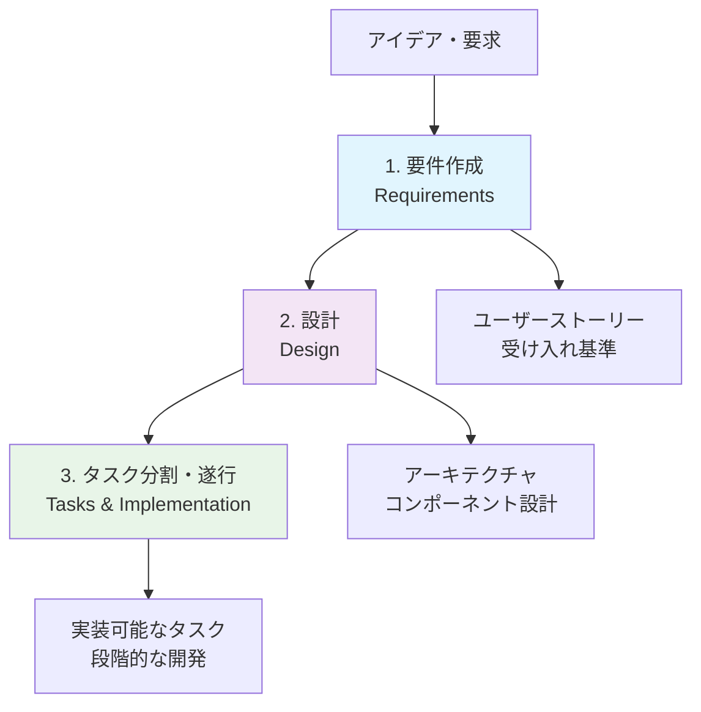

# Kiro解説

## Kiroとは

**Kiro**は、AI支援によるコーディングを効率化するための統合開発環境（IDE）です。従来の開発プロセスにAIの力を組み込み、開発者がより創造的で価値の高い作業に集中できるよう設計されています。

### Kiroの特徴

- **AIコーディングのベストプラクティス**: 業界で実証されたAI活用手法を標準搭載
- **スペック駆動開発**: 要件から実装まで体系的なアプローチ
- **直感的なユーザーインターフェース**: 学習コストを最小限に抑えた設計
- **拡張性**: プラグインやMCPによる機能拡張が可能

## なぜKiroを使うのか

### 従来の開発の課題

- 要件の曖昧さによる手戻り
- 設計とコードの乖離
- AIツールの断片的な利用
- チーム間での知識共有の困難

### Kiroが解決すること

- **体系的な開発プロセス**: 要件→設計→実装の一貫した流れ
- **AI支援の最適化**: 適切なタイミングでのAI活用
- **知識の蓄積と共有**: Steeringファイルによる組織知の活用
- **品質の向上**: 自動テストとレビューの統合

## Kiroの主要機能

### 1. Autopilot（自動操縦）モード
- AIが自動的にファイルを修正
- 開発者の承認なしに変更を適用
- 高速な開発サイクルを実現

### 2. Supervised（監督）モード
- 変更前に開発者が確認
- より慎重なアプローチ
- 学習段階や重要な変更に適用

### 3. Chat Context（チャットコンテキスト）
- `#File`や`#Folder`でファイル参照
- `#Problems`で現在の問題を把握
- `#Terminal`でターミナル情報を活用
- `#Git Diff`で変更差分を確認
- `#Codebase`で全体スキャン

### 4. Steering（操縦）
- プロジェクト固有のルールと標準を定義
- チーム全体での一貫した開発スタイル
- 自動的なコンテキスト適用

### 5. Spec（仕様）
- 構造化された機能開発プロセス
- 要件→設計→タスクの段階的アプローチ
- 複雑な機能の体系的な実装

### 6. Hooks（フック）
- イベント駆動の自動実行
- ファイル保存時のテスト実行
- カスタムワークフローの構築

### 7. MCP（Model Context Protocol）
- 外部ツールとの連携
- AWS、GitHub、Playwrightなどとの統合
- 拡張可能なエコシステム

## スペック駆動開発の3段階

Kiroの核となるのは**スペック駆動開発**です。これは以下の3段階で構成されます：



### 第1段階: 要件作成（Requirements）

**目的**: 何を作るかを明確に定義する

- **ユーザーストーリー**: 「〜として、〜したい、なぜなら〜」形式
- **受け入れ基準**: EARS形式（Easy Approach to Requirements Syntax）
- **制約条件**: 技術的・ビジネス的な制約の明記

**例**:
```
ユーザーストーリー: 
開発者として、コードレビューを自動化したい、なぜなら手動レビューは時間がかかるから

受け入れ基準:
1. WHEN プルリクエストが作成された時 THEN システムは 自動的にコードレビューを開始する
2. WHEN レビューが完了した時 THEN システムは 結果をコメントで通知する
```

### 第2段階: 設計（Design）

**目的**: どのように作るかを設計する

- **アーキテクチャ**: システム全体の構造
- **コンポーネント設計**: 各部品の役割と関係
- **データモデル**: 扱うデータの構造
- **インターフェース**: 外部との接続方法

**重要なポイント**:
- 要件を満たす具体的な設計
- 実装可能な技術選択
- 拡張性と保守性の考慮

### 第3段階: タスク分割・遂行（Tasks & Implementation）

**目的**: 実装可能な単位に分割して実行する

- **タスクの分割**: 小さく実装可能な単位に分解
- **優先順位**: 重要度と依存関係を考慮
- **段階的実装**: 動作確認しながら進める
- **テスト駆動**: 各段階でのテスト実装

**タスクの例**:
```
- [ ] 1. プロジェクト構造の作成
- [ ] 2. 基本的なAPIエンドポイントの実装
- [ ] 3. データベース接続の設定
- [ ] 4. ユーザー認証機能の実装
```

## インストールと始め方

### 1. Kiroのダウンロード

[kiro.dev](https://kiro.dev)から最新版をダウンロードしてください。

### 2. 初期設定

1. Kiroを起動
2. プロジェクトフォルダを開く
3. 基本設定を確認

### 3. 最初のプロジェクト

1. 新しいフォルダを作成
2. Kiroでフォルダを開く
3. チャットで「Hello, Kiro!」と入力
4. AIとの対話を開始

## 学習のコツ

### 効果的な学習方法

1. **小さく始める**: 簡単なプロジェクトから開始
2. **実際に手を動かす**: 読むだけでなく実践する
3. **段階的に学習**: 基本機能から高度な機能へ
4. **コミュニティを活用**: 疑問は積極的に質問

### よくある初心者の間違い

- いきなり複雑なプロジェクトに挑戦する
- 要件を曖昧なまま設計に進む
- AIに全てを任せて学習しない
- エラーメッセージを読まない

## まとめ

Kiroは単なるAIコーディングツールではなく、開発プロセス全体を支援する統合環境です。スペック駆動開発を通じて、より確実で効率的な開発を実現できます。

次のセクションでは、実際にKiroを使ってテトリスゲームを作成し、具体的な開発プロセスを体験してみましょう。

---

## 📚 学習進捗チェック

このセクションを完了したら、以下の項目ができるようになっているか確認してください：

- [ ] Kiroの基本概念と目的を説明できる
- [ ] スペック駆動開発の3段階を理解している
- [ ] Kiroの主要機能（Autopilot、Supervised、Chat Context、Steering、Spec、Hooks、MCP）を説明できる
- [ ] Kiroをインストールして基本操作ができる

---

## 🧭 ナビゲーション

| 前へ | 目次 | 次へ |
|------|------|------|
| - | [📖 目次](../../README.md) | [🎮 1.2 テトリス作成](tetris-tutorial.md) |

### 📍 現在の位置
**第1章: はじめてのKiro** > **1.1 Kiro解説** ← 現在ここ

### 🔗 関連リンク
- [🛠️ トラブルシューティング](../troubleshooting/common-issues.md)
- [❓ FAQ](../troubleshooting/faq.md)
- [📁 サンプルプロジェクト](../../examples/)