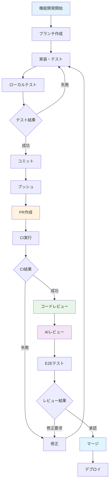

# Git連携とPRワークフローガイド

現代のソフトウェア開発では、Gitを使ったバージョン管理とプルリクエスト（PR）による協働開発が不可欠です。このセクションでは、Kiroと連携した効率的なGitワークフロー、AIを活用したPRレビュー、そしてPlaywright MCPを使ったE2Eテストの実装について学習します。

## 学習目標

- 効率的なGitワークフローを構築し実践できるようになる
- AIを活用したPRレビューの手法を習得する
- Playwright MCPを使ったE2Eテストの実装方法を学ぶ
- チーム開発での品質管理プロセスを身につける

## Gitワークフローの全体像

### ワークフロー概要



### ブランチ戦略

GitHub Flowを基本とした効率的なブランチ戦略：

- **main**: 本番環境にデプロイされる安定版
- **feature/**: 機能開発用ブランチ
- **hotfix/**: 緊急修正用ブランチ

## ステップ1: 効率的なコミット戦略

### 1.1 コミットメッセージの規約

一貫性のあるコミットメッセージ：

```
Kiroのチャットで以下のように入力してください：

プロジェクトのコミットメッセージ規約を作成したいです。

要件：
- Conventional Commits形式
- 日本語対応
- 自動生成ツールとの連携
- チーム内での統一

以下を含む規約を作成してください：
1. コミットメッセージの形式
2. タイプの定義（feat, fix, docs等）
3. スコープの定義
4. 実例集
5. 自動チェック設定
```

期待される規約例：
```
# コミットメッセージ規約

## 基本形式
<type>(<scope>): <subject>

<body>

<footer>

## タイプ定義
- feat: 新機能
- fix: バグ修正
- docs: ドキュメント更新
- style: コードスタイル修正
- refactor: リファクタリング
- test: テスト追加・修正
- chore: その他の変更

## 例
feat(auth): ユーザー認証機能を追加

JWT トークンによる認証システムを実装
- ログイン・ログアウト機能
- トークンの自動更新
- 権限チェック機能

Closes #123
```

### 1.2 ステージング戦略

効率的なファイルステージング：

```
効率的なGitステージング戦略を教えてください。

要件：
- 関連する変更のグループ化
- 部分的なステージング
- 不要なファイルの除外
- 自動化可能な部分

以下を含む戦略を提案してください：
1. .gitignoreの設定
2. ステージングのベストプラクティス
3. 便利なGitコマンド
4. VS Code拡張機能の活用
```

### 1.3 コミット前チェック

品質を保つための自動チェック：

```
コミット前の自動チェック機能を設定してください。

チェック項目：
- ESLint（コード品質）
- Prettier（フォーマット）
- TypeScript（型チェック）
- テスト実行
- コミットメッセージ検証

使用ツール：
- Husky（Git hooks）
- lint-staged（ステージされたファイルのみ）
- commitlint（コミットメッセージ）

設定ファイルとスクリプトを作成してください。
```

## ステップ2: プルリクエストの作成と管理

### 2.1 PR作成のベストプラクティス

効果的なPR作成方法：

```
効果的なプルリクエストの作成方法を教えてください。

PR要素：
- タイトルの付け方
- 説明文の書き方
- 変更内容の整理
- レビュアーの選定
- ラベルの活用

以下を含むガイドを作成してください：
1. PRテンプレート
2. チェックリスト
3. スクリーンショット添付方法
4. 関連Issue の紐付け
```

期待されるPRテンプレート：
```markdown
## 変更内容
<!-- 何を変更したかを簡潔に説明 -->

## 変更理由
<!-- なぜこの変更が必要かを説明 -->

## 影響範囲
<!-- この変更が影響する範囲を記載 -->

## テスト内容
- [ ] 単体テスト追加・更新
- [ ] 統合テスト確認
- [ ] E2Eテスト確認
- [ ] 手動テスト実施

## スクリーンショット
<!-- UI変更がある場合は before/after を添付 -->

## チェックリスト
- [ ] コードレビューを実施した
- [ ] テストが通ることを確認した
- [ ] ドキュメントを更新した
- [ ] 破壊的変更がある場合は明記した

## 関連Issue
Closes #123
```

### 2.2 PR サイズの最適化

レビューしやすいPRサイズ：

```
レビューしやすいPRサイズの指針を作成してください。

考慮事項：
- 変更行数の目安
- 機能の分割方法
- 依存関係の管理
- レビュー時間の短縮

以下を含む指針を提案してください：
1. 適切なPRサイズの基準
2. 大きなPRを分割する方法
3. 段階的なマージ戦略
4. レビュー効率化のテクニック
```

### 2.3 ドラフトPRの活用

開発中のフィードバック収集：

```
ドラフトPRを効果的に活用する方法を教えてください。

活用場面：
- 設計レビュー
- 進捗共有
- 早期フィードバック
- ペアプログラミング

以下を含む活用方法を提案してください：
1. ドラフトPRの作成タイミング
2. フィードバック収集方法
3. 進捗報告の仕方
4. 正式PRへの移行手順
```

## ステップ3: AIを活用したPRレビュー

### 3.1 Kiroを使ったコードレビュー

AIによる効率的なコードレビュー：

```
Kiroを使ってプルリクエストのコードレビューを実施したいです。

レビュー対象：
- コード品質
- セキュリティ
- パフォーマンス
- ベストプラクティス遵守
- テストカバレッジ

以下の観点からレビューしてください：
1. 機能要件の実装確認
2. コーディング規約の遵守
3. 潜在的なバグの指摘
4. 改善提案
5. テストの妥当性

具体的なレビューコメント例も含めてください。
```

### 3.2 自動レビューの設定

継続的なコード品質チェック：

```
自動コードレビューシステムを構築してください。

自動チェック項目：
- 静的解析（ESLint, SonarQube）
- セキュリティスキャン（Snyk, CodeQL）
- 依存関係チェック（npm audit）
- ライセンスチェック
- パフォーマンス分析

GitHub Actions設定：
- PR作成時の自動実行
- 結果のコメント投稿
- 品質ゲートの設定
- 失敗時の通知

設定ファイルとワークフローを作成してください。
```

### 3.3 レビューコメントの管理

効果的なレビューコメント：

```
効果的なレビューコメントの書き方を教えてください。

コメントの種類：
- 必須修正（Must fix）
- 推奨改善（Should fix）
- 提案（Nice to have）
- 質問（Question）
- 称賛（Praise）

以下を含むガイドを作成してください：
1. コメントの書き方
2. 建設的なフィードバック方法
3. 優先度の付け方
4. フォローアップの仕方

実際のコメント例も含めてください。
```

## ステップ4: Playwright MCPでのE2Eテスト

### 4.1 E2Eテスト戦略

包括的なE2Eテスト設計：

```
Playwright MCPを使ってE2Eテストを実装したいです。

テスト対象：
- ユーザー認証フロー
- タスク管理機能
- チーム機能
- リアルタイム更新
- レスポンシブ対応

以下を含むテスト戦略を作成してください：
1. テストシナリオの設計
2. テストデータの準備
3. 環境の分離
4. 並列実行の設定
5. 失敗時の対応

実際のテストコードも含めてください。
```

### 4.2 テストの自動実行

PR作成時の自動E2Eテスト：

```
PR作成時にPlaywright MCPでE2Eテストを自動実行する設定を作成してください。

実行条件：
- PR作成時
- コード変更時
- 手動トリガー
- 定期実行（夜間）

テスト環境：
- 専用のテスト環境
- データベースの初期化
- 外部サービスのモック
- 並列実行対応

結果の報告：
- テスト結果のPRコメント
- スクリーンショット添付
- 動画録画（失敗時）
- レポートの生成

GitHub Actions設定を含めてください。
```

### 4.3 視覚回帰テスト

UI変更の自動検出：

```
Playwright MCPを使って視覚回帰テストを実装してください。

テスト対象：
- 主要画面のスクリーンショット
- レスポンシブデザイン
- ダークモード対応
- 多言語対応

実装内容：
- ベースライン画像の管理
- 差分検出の設定
- 許容範囲の設定
- 更新承認フロー

テスト結果の可視化：
- 差分画像の生成
- 変更箇所のハイライト
- 承認・却下の仕組み
- 履歴管理

実際の実装例を含めてください。
```

## ステップ5: CI/CDとの統合

### 5.1 GitHub Actions ワークフロー

包括的なCI/CDパイプライン：

```yaml
# .github/workflows/pr-workflow.yml
name: PR Workflow

on:
  pull_request:
    branches: [ main, develop ]
  pull_request_review:
    types: [ submitted ]

jobs:
  code-quality:
    runs-on: ubuntu-latest
    steps:
    - uses: actions/checkout@v3
    
    - name: Setup Node.js
      uses: actions/setup-node@v3
      with:
        node-version: '18'
        cache: 'npm'
    
    - name: Install dependencies
      run: npm ci
    
    - name: Run linting
      run: npm run lint
    
    - name: Run type checking
      run: npm run type-check
    
    - name: Run unit tests
      run: npm run test:unit -- --coverage
    
    - name: Upload coverage
      uses: codecov/codecov-action@v3

  security-scan:
    runs-on: ubuntu-latest
    steps:
    - uses: actions/checkout@v3
    
    - name: Run security audit
      run: npm audit --audit-level high
    
    - name: Run CodeQL analysis
      uses: github/codeql-action/analyze@v2

  e2e-tests:
    runs-on: ubuntu-latest
    needs: [code-quality]
    steps:
    - uses: actions/checkout@v3
    
    - name: Setup test environment
      run: |
        docker-compose -f docker-compose.test.yml up -d
        npm run db:migrate:test
        npm run db:seed:test
    
    - name: Run E2E tests with Playwright MCP
      run: npm run test:e2e
      env:
        PLAYWRIGHT_MCP_ENABLED: true
    
    - name: Upload test results
      uses: actions/upload-artifact@v3
      if: failure()
      with:
        name: playwright-report
        path: playwright-report/

  ai-review:
    runs-on: ubuntu-latest
    if: github.event.action == 'opened' || github.event.action == 'synchronize'
    steps:
    - uses: actions/checkout@v3
      with:
        fetch-depth: 0
    
    - name: AI Code Review
      uses: ./actions/ai-review
      with:
        github-token: ${{ secrets.GITHUB_TOKEN }}
        openai-api-key: ${{ secrets.OPENAI_API_KEY }}

  auto-merge:
    runs-on: ubuntu-latest
    needs: [code-quality, security-scan, e2e-tests]
    if: github.event.review.state == 'approved'
    steps:
    - name: Auto merge
      uses: pascalgn/merge-action@v0.15.6
      with:
        github_token: ${{ secrets.GITHUB_TOKEN }}
        merge_method: squash
```

### 5.2 品質ゲートの設定

マージ前の品質チェック：

```
品質ゲートを設定してマージ前の品質を保証してください。

品質基準：
- テストカバレッジ: 80%以上
- ESLintエラー: 0件
- TypeScriptエラー: 0件
- セキュリティ脆弱性: 高リスクなし
- E2Eテスト: 全て成功

ゲート設定：
- GitHub branch protection rules
- 必須チェックの設定
- レビュー必須の設定
- 自動マージの条件

設定手順と設定例を含めてください。
```

### 5.3 デプロイメント戦略

安全なデプロイメント：

```
PR マージ後の自動デプロイメント戦略を設計してください。

デプロイ環境：
- Staging: 全PRマージ後
- Production: mainブランチマージ後

デプロイ手順：
1. ビルドとテスト
2. ステージング環境デプロイ
3. スモークテスト実行
4. 本番環境デプロイ（承認後）
5. ヘルスチェック
6. ロールバック準備

監視とアラート：
- デプロイ状況の通知
- エラー監視
- パフォーマンス監視
- 自動ロールバック

実装例を含めてください。
```

## ステップ6: チーム協働の最適化

### 6.1 レビュー文化の構築

建設的なレビュー文化：

```
チーム内での建設的なレビュー文化を構築する方法を教えてください。

文化の要素：
- 学習機会としてのレビュー
- 建設的なフィードバック
- 知識共有の促進
- 品質向上への意識

実践方法：
- レビューガイドラインの作成
- レビュー会の開催
- メンタリングの仕組み
- 成果の可視化

チーム全体のスキル向上につながる仕組みを提案してください。
```

### 6.2 非同期協働の促進

効率的な非同期協働：

```
リモートチームでの効率的な非同期協働方法を教えてください。

協働要素：
- コードレビュー
- 設計議論
- 問題解決
- 知識共有

ツールと手法：
- GitHub Discussions
- 非同期レビュー
- ドキュメント駆動開発
- 録画による説明

時差があるチームでも効率的に協働できる仕組みを提案してください。
```

### 6.3 メトリクスと改善

開発プロセスの継続的改善：

```
開発プロセス改善のためのメトリクス収集と分析を設定してください。

収集メトリクス：
- PR作成からマージまでの時間
- レビュー時間
- バグ発生率
- デプロイ頻度
- 障害復旧時間

分析と改善：
- ボトルネックの特定
- プロセス改善の提案
- 自動化の機会発見
- チーム生産性の向上

ダッシュボードと定期レポートの作成方法も含めてください。
```

## 実践例: タスク管理アプリのPRワークフロー

### 実際のPR例

```markdown
# PR例: タスクフィルタリング機能の追加

## 変更内容
タスク一覧画面にフィルタリング機能を追加しました。

### 追加機能
- ステータスによるフィルタ（未着手、進行中、完了）
- 担当者によるフィルタ
- 期限によるフィルタ（今日、今週、今月）
- 複数条件の組み合わせ

## 技術的変更
- `TaskFilter` コンポーネントの追加
- `useTaskFilter` カスタムフックの実装
- バックエンドAPIの拡張（クエリパラメータ対応）
- データベースインデックスの追加

## テスト
- [ ] 単体テスト: フィルタロジック
- [ ] 統合テスト: API エンドポイント
- [ ] E2Eテスト: フィルタ操作のシナリオ
- [ ] パフォーマンステスト: 大量データでの動作確認

## スクリーンショット
[フィルタ機能のスクリーンショット]

## パフォーマンス影響
- データベースクエリの最適化により、応答時間20%改善
- フロントエンドでのメモ化により、再レンダリング50%削減

Closes #456
```

### E2Eテストの実装例

```typescript
// tests/e2e/task-filtering.spec.ts
import { test, expect } from '@playwright/test';

test.describe('タスクフィルタリング機能', () => {
  test.beforeEach(async ({ page }) => {
    // テストデータの準備
    await page.goto('/login');
    await page.fill('[data-testid=email]', 'test@example.com');
    await page.fill('[data-testid=password]', 'password');
    await page.click('[data-testid=login-button]');
    
    await page.goto('/tasks');
  });

  test('ステータスフィルタが正常に動作する', async ({ page }) => {
    // 全タスクが表示されていることを確認
    await expect(page.locator('[data-testid=task-item]')).toHaveCount(10);
    
    // 「進行中」フィルタを適用
    await page.click('[data-testid=status-filter]');
    await page.click('[data-testid=status-in-progress]');
    
    // フィルタされたタスクのみ表示されることを確認
    await expect(page.locator('[data-testid=task-item]')).toHaveCount(3);
    await expect(page.locator('[data-testid=task-status]')).toHaveText(['進行中', '進行中', '進行中']);
  });

  test('複数条件フィルタが正常に動作する', async ({ page }) => {
    // ステータスと担当者の複合フィルタ
    await page.click('[data-testid=status-filter]');
    await page.click('[data-testid=status-todo]');
    
    await page.click('[data-testid=assignee-filter]');
    await page.click('[data-testid=assignee-john]');
    
    // 条件に合致するタスクのみ表示
    await expect(page.locator('[data-testid=task-item]')).toHaveCount(2);
  });

  test('フィルタクリア機能が正常に動作する', async ({ page }) => {
    // フィルタを適用
    await page.click('[data-testid=status-filter]');
    await page.click('[data-testid=status-done]');
    
    // フィルタクリア
    await page.click('[data-testid=clear-filters]');
    
    // 全タスクが再表示されることを確認
    await expect(page.locator('[data-testid=task-item]')).toHaveCount(10);
  });
});
```

## トラブルシューティング

### よくある問題と解決方法

#### 問題1: マージコンフリクト

**原因**: 複数の開発者が同じファイルを編集

**解決方法**:
```bash
# 最新のmainブランチを取得
git checkout main
git pull origin main

# フィーチャーブランチにマージ
git checkout feature/task-filtering
git merge main

# コンフリクトを解決後
git add .
git commit -m "resolve merge conflicts"
git push origin feature/task-filtering
```

#### 問題2: CI/CDの失敗

**原因**: テストの不安定性、環境の問題

**解決方法**:
```yaml
# より安定したテスト実行
- name: Run tests with retry
  run: |
    for i in {1..3}; do
      npm run test && break
      echo "Test failed, retrying..."
      sleep 10
    done
```

#### 問題3: レビューの遅延

**原因**: レビュアーの負荷、PR サイズの問題

**解決方法**:
```
- PR サイズの最適化（300行以下）
- レビュアーの自動アサイン
- レビュー期限の設定
- ドラフトPRでの早期フィードバック
```

## ベストプラクティス

### 1. コミット戦略

```
- 論理的な単位でのコミット
- 明確なコミットメッセージ
- 頻繁なコミット（1日複数回）
- 作業内容の適切な分割
```

### 2. PR管理

```
- 小さく頻繁なPR
- 明確な説明とコンテキスト
- 適切なレビュアーの選定
- 迅速なフィードバック対応
```

### 3. レビュー文化

```
- 建設的なフィードバック
- 学習機会としての活用
- 知識共有の促進
- 品質向上への意識
```

## まとめ

Git連携とPRワークフローの最適化により：

1. **品質の向上**: 体系的なレビューとテストによる品質保証
2. **効率の向上**: 自動化による開発効率の向上
3. **協働の促進**: 効果的なチーム協働の実現
4. **継続的改善**: メトリクスに基づくプロセス改善

これで第2章の内容が完了しました。次は第3章のチーム開発について学習していきます。

---

## 📚 学習進捗チェック

このセクションを完了したら、以下の項目ができるようになっているか確認してください：

- [ ] Git連携とPRワークフローを習得している
- [ ] AIによるPRレビューの活用ができる
- [ ] Playwright MCPでのE2Eテスト実装ができる
- [ ] 継続的インテグレーションの仕組みを理解している
- [ ] チーム開発の基礎を身につけている

---

<div align="center">

| [← 💻 実装・テスト](implementation-testing.md) | [🏠 目次](../../README.md) | [🤝 チーム開発セットアップ →](../chapter3/team-development-setup.md) |
|:---:|:---:|:---:|

</div>

---

### 🔗 関連リソース
- [🎭 Playwright MCP設定](../chapter1/playwright-mcp-testing.md)
- [📁 CI/CDテンプレート](../../templates/cicd/)
- [🛠️ トラブルシューティング](../troubleshooting/common-issues.md)