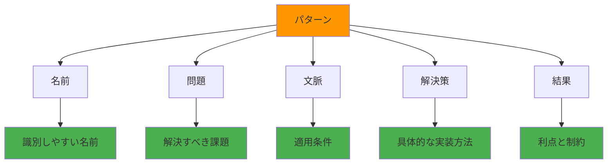

# 設計原則に必要なパタン言語の解説を作ろう

設計パターンは、ソフトウェア開発における共通の問題に対する再利用可能な解決策です。このセクションでは、設計パターンの基本概念を理解し、Kiroでの活用方法を学習します。パターン言語を習得することで、より効率的で保守性の高いソフトウェアを開発できるようになります。

## 学習目標

- 設計パターンの基本概念と重要性を理解する
- 主要な設計パターンの種類と用途を学ぶ
- Kiroでのパターン活用方法を習得する
- プロジェクト固有のパターンライブラリを構築する方法を身につける

## パターン言語とは

### 概念

**パターン言語**は、特定の文脈における問題とその解決策を体系化した知識体系です。ソフトウェア開発では、繰り返し現れる設計上の問題に対する実証済みの解決策として活用されます。

### パターンの構成要素



### パターンの価値

- **再利用性**: 実証済みの解決策の再利用
- **コミュニケーション**: 共通言語による効率的な意思疎通
- **品質向上**: ベストプラクティスの標準化
- **学習効率**: 体系化された知識の習得

## 主要な設計パターンの分類

### 1. 生成パターン（Creational Patterns）

オブジェクトの生成に関するパターン

#### Singleton パターン

**問題**: アプリケーション全体で1つのインスタンスのみが必要

**解決策**:
```typescript
class DatabaseConnection {
  private static instance: DatabaseConnection;
  private constructor() {}
  
  public static getInstance(): DatabaseConnection {
    if (!DatabaseConnection.instance) {
      DatabaseConnection.instance = new DatabaseConnection();
    }
    return DatabaseConnection.instance;
  }
}
```

**Kiroでの活用**:
```
データベース接続のSingletonパターンを実装してください。
以下の要件を満たしてください：
- インスタンスは1つのみ
- スレッドセーフな実装
- 接続プールの管理
```

#### Factory パターン

**問題**: 具体的なクラスを指定せずにオブジェクトを生成したい

**解決策**:
```typescript
interface PaymentProcessor {
  process(amount: number): Promise<boolean>;
}

class PaymentFactory {
  static create(type: 'credit' | 'paypal' | 'bank'): PaymentProcessor {
    switch (type) {
      case 'credit':
        return new CreditCardProcessor();
      case 'paypal':
        return new PayPalProcessor();
      case 'bank':
        return new BankTransferProcessor();
      default:
        throw new Error(`Unknown payment type: ${type}`);
    }
  }
}
```

### 2. 構造パターン（Structural Patterns）

クラスやオブジェクトの組み合わせに関するパターン

#### Adapter パターン

**問題**: 互換性のないインターフェースを持つクラスを連携させたい

**解決策**:
```typescript
// 既存のサードパーティライブラリ
class ThirdPartyEmailService {
  sendEmail(to: string, subject: string, body: string): void {
    // 実装
  }
}

// アプリケーションのインターフェース
interface EmailService {
  send(message: EmailMessage): Promise<void>;
}

// アダプター
class EmailServiceAdapter implements EmailService {
  constructor(private thirdPartyService: ThirdPartyEmailService) {}
  
  async send(message: EmailMessage): Promise<void> {
    this.thirdPartyService.sendEmail(
      message.recipient,
      message.subject,
      message.content
    );
  }
}
```

#### Decorator パターン

**問題**: オブジェクトに動的に機能を追加したい

**解決策**:
```typescript
interface Coffee {
  cost(): number;
  description(): string;
}

class SimpleCoffee implements Coffee {
  cost(): number { return 10; }
  description(): string { return "Simple coffee"; }
}

class MilkDecorator implements Coffee {
  constructor(private coffee: Coffee) {}
  
  cost(): number { return this.coffee.cost() + 2; }
  description(): string { return this.coffee.description() + ", milk"; }
}
```

### 3. 振る舞いパターン（Behavioral Patterns）

オブジェクト間の相互作用に関するパターン

#### Observer パターン

**問題**: オブジェクトの状態変化を複数のオブジェクトに通知したい

**解決策**:
```typescript
interface Observer {
  update(data: any): void;
}

class Subject {
  private observers: Observer[] = [];
  
  subscribe(observer: Observer): void {
    this.observers.push(observer);
  }
  
  unsubscribe(observer: Observer): void {
    this.observers = this.observers.filter(obs => obs !== observer);
  }
  
  notify(data: any): void {
    this.observers.forEach(observer => observer.update(data));
  }
}
```

#### Strategy パターン

**問題**: アルゴリズムを動的に切り替えたい

**解決策**:
```typescript
interface SortStrategy {
  sort(data: number[]): number[];
}

class QuickSort implements SortStrategy {
  sort(data: number[]): number[] {
    // クイックソートの実装
    return data;
  }
}

class MergeSort implements SortStrategy {
  sort(data: number[]): number[] {
    // マージソートの実装
    return data;
  }
}

class Sorter {
  constructor(private strategy: SortStrategy) {}
  
  setStrategy(strategy: SortStrategy): void {
    this.strategy = strategy;
  }
  
  sort(data: number[]): number[] {
    return this.strategy.sort(data);
  }
}
```

## Kiroでのパターン活用方法

### ステップ1: パターンライブラリの構築

#### 1.1 Steeringファイルでのパターン定義

`.kiro/steering/design-patterns.md`を作成：

```markdown
---
inclusion: always
---

# 設計パターンガイド

## プロジェクトで使用するパターン

### データアクセス層
- **Repository パターン**: データアクセスの抽象化
- **Unit of Work パターン**: トランザクション管理

### ビジネスロジック層
- **Service パターン**: ビジネスロジックの集約
- **Command パターン**: 操作の抽象化

### プレゼンテーション層
- **MVC パターン**: 関心の分離
- **Observer パターン**: 状態変化の通知

## 実装ガイドライン

### Repository パターン
```typescript
interface UserRepository {
  findById(id: string): Promise<User | null>;
  save(user: User): Promise<void>;
  delete(id: string): Promise<void>;
}

class DatabaseUserRepository implements UserRepository {
  // 実装
}
```
```

#### 1.2 パターンテンプレートの作成

よく使用するパターンのテンプレートを作成：

```
Kiroのチャットで以下のように入力してください：

Repository パターンのテンプレートを作成してください。
以下の要件を満たしてください：
- TypeScript対応
- 非同期処理対応
- エラーハンドリング
- 単体テスト付き
```

### ステップ2: パターンベースの開発

#### 2.1 パターンを指定した実装依頼

具体的なパターンを指定してKiroに実装を依頼：

```
ユーザー管理機能をRepository パターンで実装してください。

要件：
- User エンティティの定義
- UserRepository インターフェース
- DatabaseUserRepository 実装クラス
- InMemoryUserRepository テスト用実装
- 単体テスト

使用技術：
- TypeScript
- Prisma ORM
- Jest
```

#### 2.2 パターンの組み合わせ

複数のパターンを組み合わせた実装：

```
注文処理システムを以下のパターンで実装してください：

- Repository パターン: データアクセス
- Service パターン: ビジネスロジック
- Command パターン: 注文処理コマンド
- Observer パターン: 注文状態変更通知
- Factory パターン: 支払い処理の生成

各パターンの役割を明確に分離してください。
```

### ステップ3: パターンの検証と改善

#### 3.1 パターン適用の検証

実装されたパターンの検証：

```
実装されたRepository パターンをレビューしてください。

確認項目：
- インターフェースの適切な抽象化
- 実装クラスの責任範囲
- エラーハンドリングの妥当性
- テストカバレッジ
- パフォーマンスの考慮

改善提案があれば教えてください。
```

#### 3.2 パターンの最適化

プロジェクト固有の最適化：

```
現在のRepository パターンを以下の要件に合わせて最適化してください：

- キャッシュ機能の追加
- バッチ処理対応
- 楽観的ロック対応
- 監査ログ機能
- メトリクス収集

既存のインターフェースを破壊しないよう注意してください。
```

## フロントエンド特有のパターン

### React パターン

#### Container/Presentational パターン

**問題**: ロジックとUIの分離

**解決策**:
```typescript
// Presentational Component
interface UserListProps {
  users: User[];
  onUserSelect: (user: User) => void;
  loading: boolean;
}

const UserList: React.FC<UserListProps> = ({ users, onUserSelect, loading }) => {
  if (loading) return <div>Loading...</div>;
  
  return (
    <ul>
      {users.map(user => (
        <li key={user.id} onClick={() => onUserSelect(user)}>
          {user.name}
        </li>
      ))}
    </ul>
  );
};

// Container Component
const UserListContainer: React.FC = () => {
  const { data: users, isLoading } = useUsers();
  const navigate = useNavigate();
  
  const handleUserSelect = (user: User) => {
    navigate(`/users/${user.id}`);
  };
  
  return (
    <UserList 
      users={users || []} 
      onUserSelect={handleUserSelect}
      loading={isLoading}
    />
  );
};
```

#### Custom Hook パターン

**問題**: ロジックの再利用

**解決策**:
```typescript
// カスタムフック
const useLocalStorage = <T>(key: string, initialValue: T) => {
  const [storedValue, setStoredValue] = useState<T>(() => {
    try {
      const item = window.localStorage.getItem(key);
      return item ? JSON.parse(item) : initialValue;
    } catch (error) {
      return initialValue;
    }
  });

  const setValue = (value: T | ((val: T) => T)) => {
    try {
      const valueToStore = value instanceof Function ? value(storedValue) : value;
      setStoredValue(valueToStore);
      window.localStorage.setItem(key, JSON.stringify(valueToStore));
    } catch (error) {
      console.error(error);
    }
  };

  return [storedValue, setValue] as const;
};

// 使用例
const UserSettings: React.FC = () => {
  const [theme, setTheme] = useLocalStorage('theme', 'light');
  
  return (
    <button onClick={() => setTheme(theme === 'light' ? 'dark' : 'light')}>
      Current theme: {theme}
    </button>
  );
};
```

### State Management パターン

#### Flux/Redux パターン

**問題**: 複雑な状態管理

**解決策**:
```typescript
// Action Types
const USER_ACTIONS = {
  FETCH_USERS_REQUEST: 'FETCH_USERS_REQUEST',
  FETCH_USERS_SUCCESS: 'FETCH_USERS_SUCCESS',
  FETCH_USERS_FAILURE: 'FETCH_USERS_FAILURE',
} as const;

// Actions
const fetchUsers = () => async (dispatch: Dispatch) => {
  dispatch({ type: USER_ACTIONS.FETCH_USERS_REQUEST });
  
  try {
    const users = await userService.getUsers();
    dispatch({ 
      type: USER_ACTIONS.FETCH_USERS_SUCCESS, 
      payload: users 
    });
  } catch (error) {
    dispatch({ 
      type: USER_ACTIONS.FETCH_USERS_FAILURE, 
      payload: error.message 
    });
  }
};

// Reducer
const userReducer = (state = initialState, action: AnyAction) => {
  switch (action.type) {
    case USER_ACTIONS.FETCH_USERS_REQUEST:
      return { ...state, loading: true };
    case USER_ACTIONS.FETCH_USERS_SUCCESS:
      return { ...state, loading: false, users: action.payload };
    case USER_ACTIONS.FETCH_USERS_FAILURE:
      return { ...state, loading: false, error: action.payload };
    default:
      return state;
  }
};
```

## バックエンド特有のパターン

### API設計パターン

#### RESTful API パターン

**問題**: 一貫性のあるAPI設計

**解決策**:
```typescript
// リソースベースのルーティング
app.get('/api/users', getUsersHandler);           // GET /users - 一覧取得
app.get('/api/users/:id', getUserHandler);       // GET /users/1 - 詳細取得
app.post('/api/users', createUserHandler);       // POST /users - 作成
app.put('/api/users/:id', updateUserHandler);    // PUT /users/1 - 更新
app.delete('/api/users/:id', deleteUserHandler); // DELETE /users/1 - 削除

// 統一されたレスポンス形式
interface ApiResponse<T> {
  success: boolean;
  data?: T;
  error?: string;
  meta?: {
    total: number;
    page: number;
    limit: number;
  };
}
```

#### Middleware パターン

**問題**: 横断的関心事の処理

**解決策**:
```typescript
// 認証ミドルウェア
const authMiddleware = (req: Request, res: Response, next: NextFunction) => {
  const token = req.headers.authorization?.replace('Bearer ', '');
  
  if (!token) {
    return res.status(401).json({ error: 'Token required' });
  }
  
  try {
    const decoded = jwt.verify(token, process.env.JWT_SECRET!);
    req.user = decoded;
    next();
  } catch (error) {
    res.status(401).json({ error: 'Invalid token' });
  }
};

// ログミドルウェア
const logMiddleware = (req: Request, res: Response, next: NextFunction) => {
  console.log(`${req.method} ${req.path} - ${new Date().toISOString()}`);
  next();
};

// 使用例
app.use(logMiddleware);
app.use('/api/protected', authMiddleware);
```

## パターンライブラリの構築

### ステップ1: プロジェクト固有パターンの特定

#### 1.1 共通問題の抽出

プロジェクトで繰り返し現れる問題を特定：

```
プロジェクトで頻繁に発生する設計上の問題を分析してください。

分析対象：
- データアクセス層の実装
- API エンドポイントの設計
- エラーハンドリング
- 認証・認可
- ログ出力

各問題に対する現在の解決方法と改善案を提案してください。
```

#### 1.2 パターンの標準化

特定した問題に対するパターンを標準化：

```markdown
## プロジェクト固有パターン

### API エラーハンドリングパターン

**問題**: 一貫性のないエラーレスポンス

**解決策**:
```typescript
class ApiError extends Error {
  constructor(
    public statusCode: number,
    public message: string,
    public code?: string
  ) {
    super(message);
  }
}

const errorHandler = (error: Error, req: Request, res: Response, next: NextFunction) => {
  if (error instanceof ApiError) {
    return res.status(error.statusCode).json({
      success: false,
      error: {
        message: error.message,
        code: error.code
      }
    });
  }
  
  // 予期しないエラー
  res.status(500).json({
    success: false,
    error: {
      message: 'Internal server error'
    }
  });
};
```
```

### ステップ2: パターンドキュメントの作成

#### 2.1 パターンカタログの構築

```markdown
# プロジェクトパターンカタログ

## 目次
1. [データアクセスパターン](#data-access)
2. [API設計パターン](#api-design)
3. [認証パターン](#authentication)
4. [エラーハンドリングパターン](#error-handling)
5. [テストパターン](#testing)

## データアクセスパターン {#data-access}

### Repository + Unit of Work パターン

**適用場面**: 複雑なデータ操作が必要な場合

**実装例**:
```typescript
interface UnitOfWork {
  userRepository: UserRepository;
  orderRepository: OrderRepository;
  commit(): Promise<void>;
  rollback(): Promise<void>;
}
```

**使用方法**:
```typescript
const uow = new DatabaseUnitOfWork();
try {
  const user = await uow.userRepository.findById(userId);
  const order = new Order(user, items);
  await uow.orderRepository.save(order);
  await uow.commit();
} catch (error) {
  await uow.rollback();
  throw error;
}
```
```

#### 2.2 パターン適用ガイド

```markdown
## パターン選択ガイド

### データアクセス層

| 要件 | 推奨パターン | 理由 |
|------|-------------|------|
| 単純なCRUD | Active Record | 実装が簡単 |
| 複雑なクエリ | Repository | テスタビリティ向上 |
| トランザクション管理 | Unit of Work | 整合性保証 |

### ビジネスロジック層

| 要件 | 推奨パターン | 理由 |
|------|-------------|------|
| 複雑な計算 | Service | 責任の分離 |
| 状態変化の通知 | Observer | 疎結合 |
| 条件分岐の多い処理 | Strategy | 拡張性 |
```

## パターンの進化と改善

### 継続的改善プロセス

#### 1. パターンの効果測定

```
現在使用しているパターンの効果を測定してください。

測定指標：
- 開発速度（機能実装時間）
- コード品質（複雑度、重複率）
- バグ発生率
- 保守性（変更容易性）

改善が必要なパターンを特定してください。
```

#### 2. 新しいパターンの導入

```
以下の新しい要件に対応するパターンを提案してください：

要件：
- マイクロサービス間通信
- イベント駆動アーキテクチャ
- リアルタイム通信
- 大量データ処理

既存のパターンとの整合性を考慮してください。
```

#### 3. パターンの廃止と統合

```
使用頻度の低いパターンや重複するパターンを整理してください。

整理対象：
- 過去6ヶ月で使用されていないパターン
- 類似機能を持つパターン
- 保守コストの高いパターン

統合・廃止の提案をしてください。
```

## まとめ

パターン言語の活用により：

1. **設計品質の向上**: 実証済みの解決策による信頼性
2. **開発効率の向上**: 再利用可能なソリューション
3. **チーム協働の促進**: 共通言語による効率的なコミュニケーション
4. **知識の蓄積**: プロジェクト固有のベストプラクティス

次のセクションでは、これらのパターンを活用した実際の設計・レビュー・実装フローについて学習します。

---

## 📚 学習進捗チェック

このセクションを完了したら、以下の項目ができるようになっているか確認してください：

- [ ] 設計パターンの基本概念と重要性を理解している
- [ ] 主要な設計パターン（生成・構造・振る舞い）を説明できる
- [ ] Kiroでパターンを活用した実装を依頼できる
- [ ] プロジェクト固有のパターンライブラリを構築できる
- [ ] パターンの効果測定と改善ができる

---

## 🧭 ナビゲーション

| 前へ | 目次 | 次へ |
|------|------|------|
| [📋 2.3 Steering設計原則](steering-design-principles.md) | [📖 目次](../../README.md) | [📝 2.5 設計・レビュー・実装](design-review-implementation.md) |

### 📍 現在の位置
**第2章: 本格的なアプリを作ろう** > **2.4 パターン言語解説** ← 現在ここ

### 🔗 関連リンク
- [📋 Steeringファイル設計原則](steering-design-principles.md)
- [🛠️ トラブルシューティング](../troubleshooting/common-issues.md)
- [📁 設定テンプレート](../../templates/steering/)