# Steeringファイルに設計原則を定義しよう

Steeringファイルは、Kiroでプロジェクト固有のルールや標準を定義し、AIとの協働開発を効率化するための重要な機能です。このセクションでは、Steeringファイルの概念、作成方法、そして効果的な設計原則の定義方法を学習します。

## 学習目標

- Steeringファイルの概念と利点を理解する
- プロジェクト固有の設計原則を定義する方法を習得する
- チーム開発での一貫性を保つ仕組みを学ぶ
- 実践的なSteeringファイルの作成と管理方法を身につける

## Steeringファイルとは

### 概念

**Steeringファイル**は、Kiroが開発プロセスで参照するプロジェクト固有のガイドラインやルールを定義するMarkdownファイルです。これにより、AIが一貫した開発スタイルでコードを生成し、プロジェクトの品質を維持できます。

### 主な機能

```mermaid
graph TD
    A[Steeringファイル] --> B[コーディング規約]
    A --> C[設計原則]
    A --> D[技術スタック]
    A --> E[プロジェクト固有ルール]
    
    B --> F[一貫したコード生成]
    C --> G[適切な設計判断]
    D --> H[技術選択の統一]
    E --> I[プロジェクト要件の遵守]
    
    style A fill:#ff9800
    style F fill:#4caf50
    style G fill:#4caf50
    style H fill:#4caf50
    style I fill:#4caf50
```



### 利点

- **一貫性の確保**: チーム全体で統一された開発スタイル
- **品質向上**: 事前定義されたルールによる品質保証
- **効率化**: 繰り返し説明する必要がない
- **知識共有**: プロジェクトの暗黙知を明文化

## ステップ1: Steeringファイルの基本構造

### 1.1 ファイル配置場所

Steeringファイルは`.kiro/steering/`フォルダに配置します：

```
.kiro/
└── steering/
    ├── project-basics.md      # プロジェクト基本原則
    ├── coding-standards.md    # コーディング規約
    ├── architecture.md        # アーキテクチャガイド
    └── security.md           # セキュリティガイドライン
```

### 1.2 基本的なファイル構造

Steeringファイルの基本構造：

```markdown
---
inclusion: always
---

# ファイルタイトル

## 概要
このファイルの目的と適用範囲

## 原則・ルール
具体的なガイドライン

## 実装例
コード例やベストプラクティス

## 注意事項
特別な考慮事項や制約
```

### 1.3 Front-matter設定

ファイルの適用条件を設定：

- **`inclusion: always`**: 常に適用
- **`inclusion: fileMatch`**: 特定ファイルにマッチした時のみ適用
- **`inclusion: manual`**: 手動で指定した時のみ適用

## ステップ2: プロジェクト基本原則の定義

### 2.1 基本原則ファイルの作成

`.kiro/steering/project-basics.md`を作成：

```
Kiroのチャットで以下のように入力してください：

プロジェクトの基本原則を定義するSteeringファイルを作成したいです。
.kiro/steering/project-basics.md に以下の内容を含むファイルを作成してください：

1. 開発哲学
2. 品質基準
3. 技術スタック
4. プロジェクト固有のルール
```

### 2.2 開発哲学の定義

プロジェクトの根本的な考え方を定義：

```markdown
---
inclusion: always
---

# プロジェクト基本原則

## 開発哲学

### ユーザーファースト
- ユーザー体験を最優先に考える
- 使いやすさと直感性を重視
- アクセシビリティを標準として組み込む

### 品質重視
- 動作するコードより、保守可能なコードを書く
- テストファーストの開発を実践
- コードレビューを必須とする

### 継続的改善
- 小さな改善を積み重ねる
- フィードバックを積極的に取り入れる
- 技術的負債を定期的に解消する
```

### 2.3 技術スタックの明文化

使用技術とその理由を明記：

```markdown
## 技術スタック

### フロントエンド
- **React 18+**: コンポーネントベースの開発
- **TypeScript**: 型安全性の確保
- **Tailwind CSS**: 効率的なスタイリング
- **React Query**: サーバー状態管理

### バックエンド
- **Node.js + Express**: JavaScript統一による開発効率
- **PostgreSQL**: リレーショナルデータの管理
- **Prisma**: 型安全なORM

### 開発・運用
- **Docker**: 環境の統一
- **GitHub Actions**: CI/CDパイプライン
- **AWS**: クラウドインフラ
```

## ステップ3: コーディング規約の定義

### 3.1 コーディング規約ファイルの作成

`.kiro/steering/coding-standards.md`を作成：

```markdown
---
inclusion: always
---

# コーディング規約

## 命名規則

### JavaScript/TypeScript
- **変数・関数**: camelCase (`userName`, `getUserData`)
- **定数**: UPPER_SNAKE_CASE (`API_BASE_URL`, `MAX_RETRY_COUNT`)
- **クラス・コンポーネント**: PascalCase (`UserProfile`, `DataService`)
- **ファイル名**: kebab-case (`user-profile.tsx`, `data-service.ts`)

### データベース
- **テーブル名**: snake_case (`user_profiles`, `order_items`)
- **カラム名**: snake_case (`created_at`, `user_id`)

## ファイル構成

### プロジェクト構造

src/
├── components/          # 再利用可能なUIコンポーネント
│   ├── ui/             # 基本UIコンポーネント
│   └── features/       # 機能固有コンポーネント
├── pages/              # ページコンポーネント
├── hooks/              # カスタムフック
├── services/           # API・外部サービス連携
├── utils/              # ユーティリティ関数
├── types/              # TypeScript型定義
└── constants/          # 定数定義

## コード品質

### 必須事項
- すべての関数に適切な型注釈
- 公開関数にはJSDocコメント
- エラーハンドリングの実装
- 単体テストの作成

### 推奨事項
- 関数は50行以内に収める
- ネストは3階層まで
- 意味のある変数名を使用
- マジックナンバーを避ける
```

### 3.2 条件付き適用の設定

特定のファイルタイプにのみ適用する場合：

```markdown
---
inclusion: fileMatch
fileMatchPattern: '*.tsx'
---

# React コンポーネント規約

## コンポーネント設計原則

### 単一責任の原則
- 1つのコンポーネントは1つの責任のみ
- 複雑な場合は小さなコンポーネントに分割

### Props設計
- 必要最小限のpropsのみ受け取る
- デフォルト値を適切に設定
- 型定義を明確にする

## 実装例

```typescript
interface UserCardProps {
  user: User;
  onEdit?: (user: User) => void;
  showActions?: boolean;
}

export const UserCard: React.FC<UserCardProps> = ({
  user,
  onEdit,
  showActions = true
}) => {
  // 実装
};
```

## ステップ4: アーキテクチャガイドの作成

### 4.1 システム設計原則

`.kiro/steering/architecture.md`を作成：

```markdown
---
inclusion: always
---

# アーキテクチャガイド

## 設計原則

### レイヤードアーキテクチャ

Presentation Layer (UI Components)
        ↓
Business Logic Layer (Hooks, Services)
        ↓
Data Access Layer (API, Database)


### 依存関係の方向
- 上位レイヤーは下位レイヤーに依存
- 下位レイヤーは上位レイヤーに依存しない
- インターフェースを通じた疎結合

## データフロー

### 状態管理
- **ローカル状態**: useState, useReducer
- **サーバー状態**: React Query
- **グローバル状態**: Context API（最小限）

### API通信

// サービス層でAPI呼び出しを抽象化
export const userService = {
  async getUser(id: string): Promise<User> {
    const response = await api.get(`/users/${id}`);
    return response.data;
  }
};

// フックでビジネスロジックを管理
export const useUser = (id: string) => {
  return useQuery(['user', id], () => userService.getUser(id));
};


## セキュリティ考慮事項

### 認証・認可
- JWTトークンによる認証
- ロールベースアクセス制御
- APIエンドポイントでの権限チェック

### データ保護
- 入力値の検証とサニタイズ
- SQLインジェクション対策
- XSS攻撃対策
```

### 4.2 パフォーマンス指針

パフォーマンスに関するガイドライン：

```markdown
## パフォーマンス最適化

### フロントエンド
- **コード分割**: React.lazy, Suspense
- **メモ化**: React.memo, useMemo, useCallback
- **画像最適化**: WebP形式、適切なサイズ
- **バンドルサイズ**: 不要なライブラリの除去

### バックエンド
- **データベース**: インデックスの適切な設定
- **キャッシュ**: Redis活用
- **API**: ページネーション実装
- **レスポンス**: 必要なデータのみ返却

### 測定指標
- **Core Web Vitals**: LCP, FID, CLS
- **API応答時間**: 95パーセンタイルで500ms以下
- **データベースクエリ**: 100ms以下
```

## ステップ5: 外部ファイル参照の活用

### 5.1 外部ドキュメントの参照

Steeringファイルから他のファイルを参照：

```markdown
---
inclusion: always
---

# API設計ガイド

## OpenAPI仕様

詳細なAPI仕様は以下を参照：
#[[file:docs/api-spec.yaml]]

## 実装例

GraphQLスキーマの定義：
#[[file:src/schema/user.graphql]]
```

### 5.2 設定ファイルの参照

設定ファイルを参照して一貫性を保つ：

```markdown
## 環境設定

### 開発環境設定
#[[file:.env.development]]

### 本番環境設定
#[[file:.env.production]]

### Docker設定
#[[file:docker-compose.yml]]
```

## ステップ6: チーム開発での活用

### 6.1 役割別Steeringファイル

チームの役割に応じたファイル作成：

```
.kiro/steering/
├── frontend-developer.md    # フロントエンド開発者向け
├── backend-developer.md     # バックエンド開発者向け
├── designer.md             # デザイナー向け
└── qa-engineer.md          # QAエンジニア向け
```

### 6.2 プロジェクトフェーズ別設定

開発フェーズに応じた設定：

```markdown
---
inclusion: manual
---

# MVP開発フェーズ

## 優先事項
- 最小限の機能実装
- 早期リリース重視
- 技術的負債は後回し

## 制約事項
- 新しい技術の導入禁止
- 複雑な最適化は実装しない
- UIは基本的なデザインのみ

## 完了条件
- 基本機能の動作確認
- 簡単なE2Eテスト通過
- デプロイ可能な状態
```

## ステップ7: Steeringファイルの管理

### 7.1 バージョン管理

Steeringファイルの変更管理：

```bash
# Steeringファイルの変更をコミット
git add .kiro/steering/
git commit -m "Update coding standards for TypeScript 5.0"

# チームメンバーに変更を通知
git push origin main
```

### 7.2 定期的な見直し

定期的な更新プロセス：

```markdown
## Steeringファイル見直しプロセス

### 月次レビュー
- 新しい技術動向の反映
- チームフィードバックの取り込み
- 実際の開発との乖離確認

### 四半期更新
- 大きな方針変更の検討
- 技術スタックの見直し
- パフォーマンス指標の更新

### 年次見直し
- 全体的なアーキテクチャ見直し
- 新しいベストプラクティスの導入
- 不要なルールの削除
```

### 7.3 効果測定

Steeringファイルの効果を測定：

```
効果測定指標：
1. コードレビューでの指摘事項減少
2. 開発速度の向上
3. バグ発生率の低下
4. チーム内の認識統一度
```

## 実践例: Webアプリケーション開発

### 実際のSteeringファイル例

```markdown
---
inclusion: always
---

# タスク管理アプリ開発ガイド

## プロジェクト概要
小規模チーム向けのタスク管理Webアプリケーション

## 技術制約
- React 18 + TypeScript必須
- Material-UI使用禁止（Tailwind CSS使用）
- 外部API連携は最小限に

## 機能要件
- ユーザー認証（JWT）
- タスクCRUD操作
- チームメンバー管理
- リアルタイム更新（Socket.io）

## 非機能要件
- レスポンス時間: 2秒以内
- 同時ユーザー: 100人まで
- ブラウザ対応: Chrome, Firefox, Safari最新版

## 実装優先順位
1. 基本的なタスク管理機能
2. ユーザー認証
3. チーム機能
4. リアルタイム更新
5. 高度な検索・フィルタ機能
```

## トラブルシューティング

### よくある問題と解決方法

#### 問題1: Steeringファイルが適用されない

**原因**: ファイルパスやfront-matter設定の誤り

**解決方法**:
```bash
# ファイル配置確認
ls -la .kiro/steering/

# front-matter構文確認
head -5 .kiro/steering/project-basics.md
```

#### 問題2: 設定が競合する

**原因**: 複数のSteeringファイルで矛盾する設定

**解決方法**:
```markdown
# 優先順位を明記
---
inclusion: always
priority: high
---

# より具体的な条件を設定
---
inclusion: fileMatch
fileMatchPattern: 'src/components/**/*.tsx'
---
```

#### 問題3: チーム内で設定が統一されない

**原因**: Steeringファイルの共有不足

**解決方法**:
```bash
# プロジェクトREADMEに記載
echo "## Steeringファイル" >> README.md
echo "開発前に .kiro/steering/ の内容を確認してください" >> README.md

# 新メンバー向けドキュメント作成
```

## ベストプラクティス

### 1. 段階的な導入

```
1. 基本的なコーディング規約から開始
2. プロジェクト固有ルールを追加
3. 高度な設計原則を導入
4. チーム全体での運用を確立
```

### 2. 具体的で実践的な内容

```
良い例：
- 関数は50行以内に収める
- エラーハンドリングを必ず実装
- TypeScriptの型注釈を省略しない

悪い例：
- 良いコードを書く
- セキュリティに注意する
- パフォーマンスを考慮する
```

### 3. 継続的な改善

```
- 実際の開発で問題が発生したら即座に更新
- チームフィードバックを定期的に収集
- 新しい技術動向を反映
- 不要になったルールは削除
```

## まとめ

Steeringファイルの活用により：

1. **一貫した開発スタイル**: チーム全体での統一された品質
2. **効率的な開発**: 繰り返し説明不要な自動化
3. **知識の蓄積**: プロジェクトノウハウの明文化
4. **品質向上**: 事前定義されたルールによる品質保証

次のセクションでは、設計パターンの基本概念とKiroでの活用方法について学習します。

---

## 📚 学習進捗チェック

このセクションを完了したら、以下の項目ができるようになっているか確認してください：

- [ ] Steeringファイルの概念と利点を理解している
- [ ] プロジェクト固有の設計原則を定義できる
- [ ] チーム開発での一貫性を保つ仕組みを構築できる
- [ ] Steeringファイルの作成と管理ができる
- [ ] 外部ファイル参照を活用できる

---

## 🧭 ナビゲーション

| 前へ | 目次 | 次へ |
|------|------|------|
| [⚙️ 2.2 AWS MCP設定](aws-mcp-setup.md) | [📖 目次](../../README.md) | [🏗️ 2.4 パターン言語解説](pattern-language.md) |

### 📍 現在の位置
**第2章: 本格的なアプリを作ろう** > **2.3 Steering設計原則** ← 現在ここ

### 🔗 関連リンク
- [📁 Steeringテンプレート](../../templates/steering/)
- [🏗️ パターン言語解説](pattern-language.md)
- [🛠️ トラブルシューティング](../troubleshooting/common-issues.md)